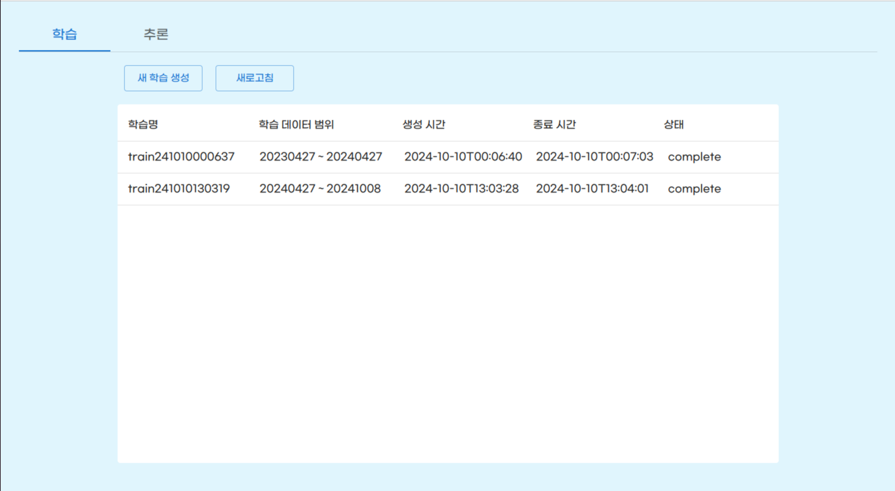
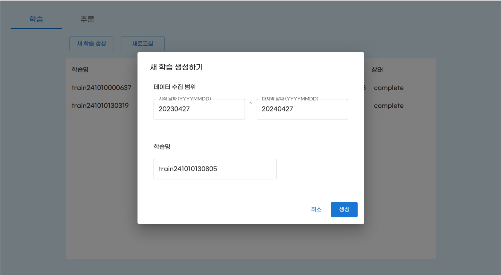
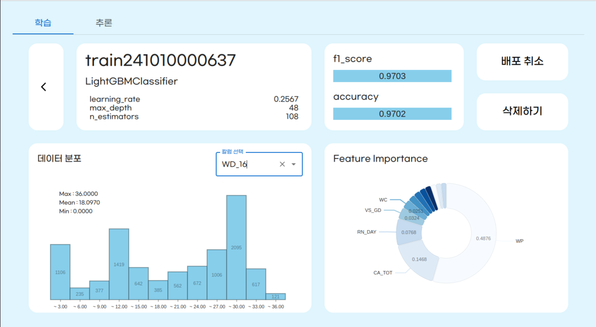
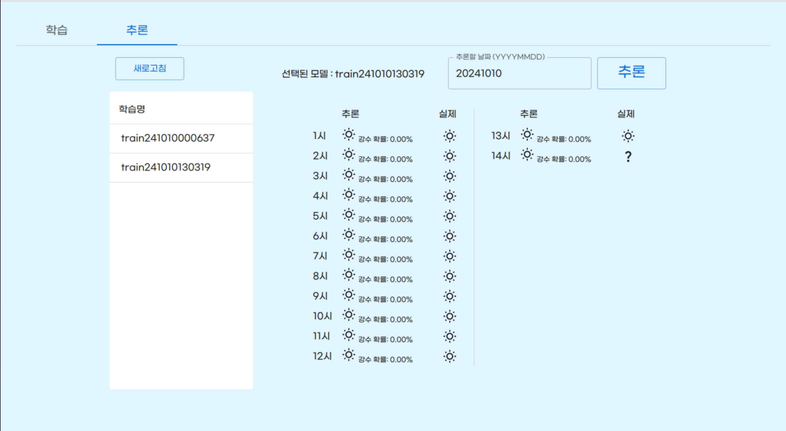

# rain-forecast-mlops

## Structure


## Description

기상청 오픈 API에서 제공하는 날씨 관련 측정 데이터를 이용한 강수 여부 예측 모델 관리 시스템이다.

1시간 단위의 측정 정보를 받아 각 시간의 측정정보를 통해 다음 시간의 강수 여부를 판단하는 분류 모델을 이용했다.

기상청 API로부터 지정한 날짜 구간의 데이터를 받아 학습시켜 새로운 모델을 생성하고 관리하는 기능과,
생성된 모델을 이용해 지정한 날짜에 대한 추론 결과를 반환할 수 있도록 배포할 수 있는 기능을 제공한다.

## Install

```commandline
$ cd helm
$ kubectl create ns rain-forecast-mlops
$ helm upgrade --install rain-forecast-mlops rain-forecast-mlops
```
- kubernetes 환경에 helm chart를 이용하여 배포할 수 있다.
- 배포 전 kserve 및 관련 모듈을 설치해야한다. quick_install.sh script로 설치 가능하다. (kserve github 참고)
- 테스트 버전
  - kubernetes: v1.30.0
  - minikube: v1.33.1
  - kserve: 0.13.0
  - istio: 1.20.4
  - knative serving: v1.13.1
  - cert manager: v1.9.0
- kserve 0.7 이상의 버전에서 작동하지만 관련 모듈 간의 의존성은 확인이 필요하다.
- docker.io registry에 저장된 이미지를 이용한다. 
  - 이미지는 각 폴더의 build_push.sh script를 이용해 저장한다.
- istio, minikube 버전에 따른 ip, port 그리고 namespace, 자원 설정 정보 등은 helm/rain-forecast-mlops/values.yaml에서 수정할 수 있다.

# Example

<div style="display: flex; justify-content: center; align-items: center;">
  
  
</div>
<p style="text-align: center;">학습 관리</p>

<div style="text-align: center;">
  
  <p>모델 결과 확인</p>
</div>

<div style="text-align: center;">
  
  <p>추론 결과 확인 </p>
</div>

# Backend

백엔드 서버는 FastAPI를 이용해 간단한 train job CRUD, kserve trainedmodels 생성 / 삭제 기능 등을 구현했다. 

고민했던 부분은 진행중인 학습 상태를 어떻게 조회할 지와, 학습이 완료된 후 학습에 대한 리포트와 모델 파일을 어떻게 관리할 지 였다.

학습 상태의 경우 학습 테이블에 status를 둔 후 학습이 진행되는 pod에서 직접 api를 호출하여 상태를 업데이트하도록 구현했다.
이를 위해 학습 생성시 backend 주소를 env 변수로 넣어주는 작업이 필요했다.

학습이 완료된 후 모델 파일과 관련 데이터를 저장하는 것 또한 DB로 관리하기로 했다. 
local에서 학습 코드를 돌려 테스트 해봤을 때 반환되는 모델 파일의 크기가 수백 키로바이트 정도로 크지 않았고, 
MySQL에 BLOB 저장이 가능한 것을 확인하여 상태 관리와 비슷한 로직으로 구현하기로 했다.

모델 저장과 관련해서 기억에 남는 트러블 슈팅 과정이 하나 있다. 학습 결과 생성되는 모델의 predictor.pkl파일을 저장하는 과정에서
upload api를 호출한 후 DB 저장까지는 문제없이 진행되지만, 저장된 모델을 다운로드 받아 로드하면 "pickle load ran out of input" 에러가 발생했다.
처음에는 파일을 저장하는 과정에서 포맷 설정에 문제가 있었던 걸로 생각하여 파일 포맷을 변경해보며 꽤 오랜시간 테스트를 했었다.
구글링 결과 알게된 문제 원인은 predictor.pkl을 로드하여 전송하는 파일에 있었다.
predictor object를 먼저 predictor.pkl이라는 파일을 wb로 열어 저장한 뒤에,
predictor.pkl을 다시 rb로 열어 전송하는 방식이었는데, wb로 열어 저장한 후 이를 정상적으로 닫지 않아 발생한 문제였다.

그 외에도 kserve에 제출된 trainedmodel이 모델을 다운로드 받아갈 수 있도록 모델 다운로드 api 등을 구현했다.

# Frontend

프론트엔드는 React typescript로 작성했으며, nginx 서버를 이용해 백엔드 서버와 Istio 서버에 각각 연결할 수 있도록 프록시를 구축했다.

kserve에 배포된 모델 서빙 기능을 이용하는 url과 백엔드 서버의 url이 달라 cors 문제가 생길 수 있는 점이 고려할 만한 점이었지만,
프론트 배포는 nginx에 달아서 프록시로 api를 이용하는 방식을 평소에도 선호하여 큰 문제는 없었다.

언급할 만한 재밌는 구현 방식이 있다면, docker entrypoint에서 pod에 env값으로 설정된 여러 변수를 nginx.conf에 replace해주는 작업에 있다.
Kserve의 inference service를 이용할 때는 host 값에 namespace정보가 필요하다.
이 namespace값을 pod env 변수로 받아서 넘겨주고 싶었는데, pod의 image는 nginx기 때문에 이미 프론트의 관련 파일은 빌드되어 main.js로 작성된 상태였다.
생각해보니 main.js도 어떻게 보면 텍스트 파일이어서 코드상에서 namespace값을 TOENVNAMESPACE와 같이 작성해놓고, docker entrypoint에서 단순히 string replace작업을 진행하도록 하여 구현했다.


# Model

모델은 각 시간의 기상 정보를 이용해서 다음 1시간의 강수 여부를 판단하는 classifier 모델을 설계했다.

기상청 api를 호출하여 입력받은 날짜 구간의 데이터를 로드하는 data_loader와
각 칼럼의 타입 및 unique value를 카운트하여 삭제할 칼럼과 범주형 변수로 사용할 칼럼, 수치형 변수로 사용할 칼럼을 분류하는 preprocessing,
삭제할 칼럼을 삭제하고, 범주형 변수에 대해서는 one-hot encoding을 진행하며, y값으로 사용할 label을 달아주는 작업을 진행하는 feature engineering,
configspace를 정의하고 그 범위 내에서 HPO를 진행하여 모델을 학습시키는 trainer로 구성된다.

모델은 decision tree 기반 모델을 이용했으며, bagging의 대표 모델인 RandomForest와 boosting 모델 중 하나인 LightGBM을 각각 이용했다.

특이한 점이 있다면, 모델의 선택 자체를 HPO 과정에 넣은 것인데, 
HPO과정에서 탐색할 configspace를 정의할 때 모델 명을 categorical parameter로 넣어 각 iteration마다 선택된 모델을 이용하여 평가를 진행할 수 있도록 구현했다.
이를 위해 두 모델을 하나의 포맷으로 다룰 수 있도록 ModelRunner라는 class를 만들어 관리했다. 

# Future Work

- FastAPI의 경우 이번 프로젝트를 통해 처음 다루어봤기도하고, 
프로젝트 개발 기간이 길지 않아 백엔드가 굉장히 미니멀하게 구현됐다. 
특히 아쉬운 부분을 꼽자면 K8S client를 이용해 job이나 trainedmodel을 관리하는 부분에서 에러 핸들링이나 validation과정이 많이 생략됐다. 
기회가 된다면 이 부분을 보완하면 조금 더 안정적인 시스템이 될 것이다.

- 데이터를 보고 프로젝트를 구상한게 아니라 MLOps 프로젝트를 만들자라고 생각한 뒤, 
추론할 데이터를 주기적으로 받을 수 있고, 또 실제값도 확인할 수 있어 모델을 평가할 수도 있는 데이터가 뭐가 있을까 하다가
날씨 데이터를 생각하고 사용하게 됐다. 
그러다보니 한시간 뒤의 날씨를 추론하는 실효성이 떨어지는 기능을 구현하게 됐고, 데이터 자체도 input에 강수 관련 정보가 너무 많아 
성능이 안 나올 수가 없는 모델이다. MLOps 부분만 살리고 데이터 및 모델에 대한 설계는 다른 데이터로 대체하는 것이 좋을 것 같다. 